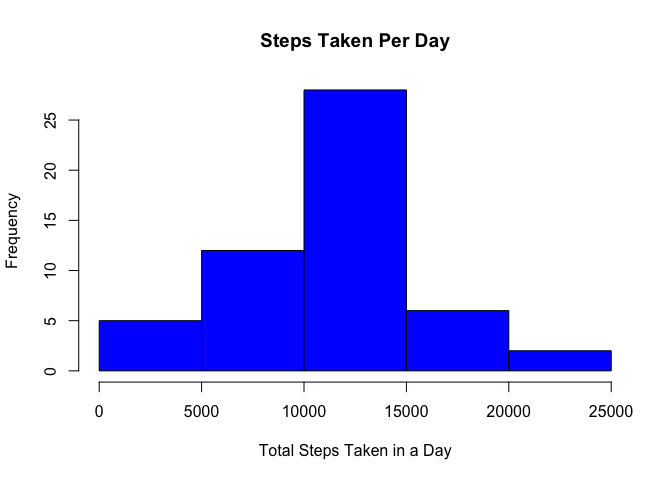
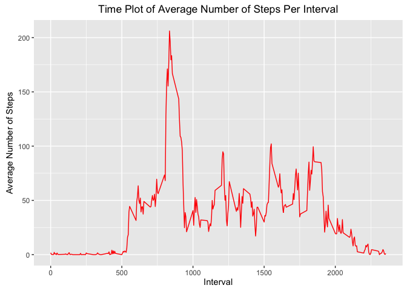
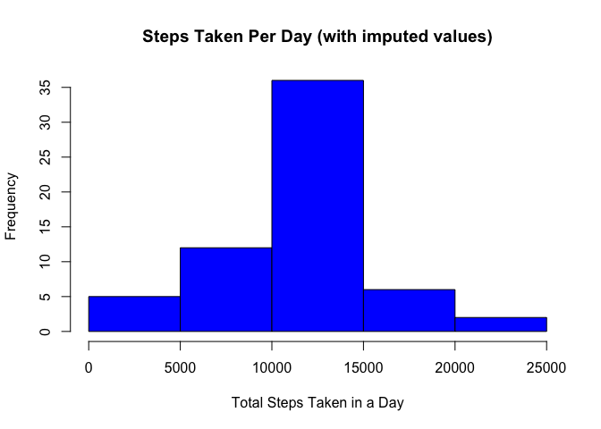
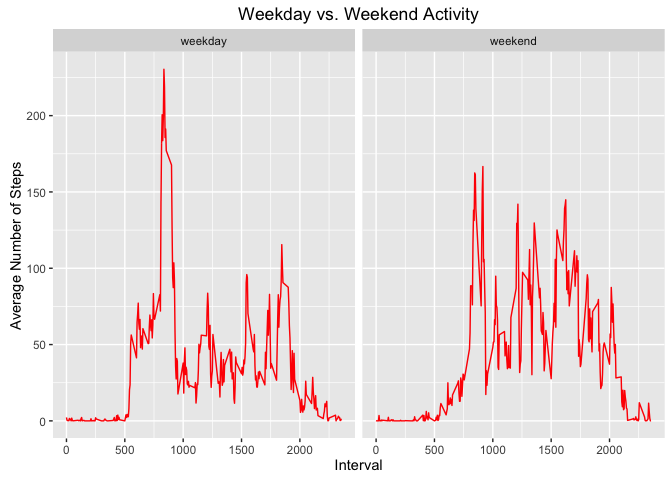

# Reproducible Research: Peer Assessment 1


## Introduction

The aim of this exercise is to briefly examine the data gathered from a personal activity monitoring device. The data was collected at 5 minute intervals throughout the day and consists of two months of data collected during October and November, 2012. The data is available as a downloadable zip file  [here](https://d396qusza40orc.cloudfront.net/repdata%2Fdata%2Factivity.zip)


## Loading and preprocessing the data

Let's make sure we have the data first, then we'll read the data into R.


```r
if(!file.exists("activity.csv")){
      url<-"https://d396qusza40orc.cloudfront.net/repdata%2Fdata%2Factivity.zip"
      download.file(url,dest="activity.zip")
}
unzip("~/activity.zip")
activity<-read.csv("activity.csv",stringsAsFactors=F)
```


## What is mean total number of steps taken per day?

Now let's look at a histogram of the number of steps taken each day. To do that, let's first aggregate the data by date and sum the number of steps taken on that day. 


```r
activityagg<-aggregate(steps~date,activity,sum)
```

Just for fun,let's take a look at the head of activityagg.


```r
head(activityagg)
```

```
##         date steps
## 1 2012-10-02   126
## 2 2012-10-03 11352
## 3 2012-10-04 12116
## 4 2012-10-05 13294
## 5 2012-10-06 15420
## 6 2012-10-07 11015
```

All right! Let's look at a histogram of the steps taken in each day.


```r
hist(activityagg$steps,main="Steps Taken Per Day",xlab="Total Steps Taken in a Day",col="blue")
```

<!-- -->

As you can see, the test subject took between 10,000 and 15,000 steps in one day most frequently.  Maybe this person has a daily routine?  On average, how many steps did the test subject take everyday? Let's look at the mean and median of the total steps taken each day of the test period.


```r
mean(activityagg$steps)
```

```
## [1] 10766.19
```

```r
median(activityagg$steps)
```

```
## [1] 10765
```

A little more than 10766 steps everyday. That's more than 5 miles!

## What is the average daily activity pattern?

Next, let's look at what an average day looked like (number-of-steps-wise) for the test subject. To do this, we'll aggregate the data according to the interval of the day and calculate the mean number of steps for each interval.


```r
intagg<-aggregate(steps~interval,activity,mean)
```

Now we'll construct a plot for the aggregated interval data. Let's use ggplot2 for this.


```r
library(ggplot2)
intplot<-ggplot(intagg,aes(interval,steps))+geom_line(col="red")+
      labs(x="Interval",y=expression("Average Number of Steps"))+
      labs(title=expression("Time Plot of Average Number of Steps Per Interval"))
print(intplot)
```

<!-- -->

Interesting! Daily activity begins a little after 5:30 in the mornings and typically ends around 10:30.
When is the test subject most active? What time of day did this person take the most number of steps and how many steps was it on average? Let's take a look.


```r
peakrow<-which(intagg$steps==max(intagg$steps))
intagg$interval[peakrow]
```

```
## [1] 835
```

```r
max(intagg$steps)
```

```
## [1] 206.1698
```

So the test subject peaked at 206.17 steps on average between 8:30 and 8:35 in the morning during the test period.

## Imputing missing values

Let's take a look at the top of the activity data set.


```r
head(activity)
```

```
##   steps       date interval
## 1    NA 2012-10-01        0
## 2    NA 2012-10-01        5
## 3    NA 2012-10-01       10
## 4    NA 2012-10-01       15
## 5    NA 2012-10-01       20
## 6    NA 2012-10-01       25
```

Looks like there are some NA values in the steps column.  Let's see how many there are.


```r
sum(is.na(activity$steps))
```

```
## [1] 2304
```

That's an appreciable number of missing values.  Let's impute the NA values with the value for each corresponding interval from our intagg set. Let's do it to a copy of the original data set.


```r
actimpute<-activity
for(i in 1:17568){
        if(is.na(actimpute$steps[i])){
                actimpute$steps[i]<-intagg$steps[which(intagg$interval==actimpute$interval[i])]
        }
}
```

Let's look at the activity data set again to see if we were successful.


```r
head(actimpute)
```

```
##       steps       date interval
## 1 1.7169811 2012-10-01        0
## 2 0.3396226 2012-10-01        5
## 3 0.1320755 2012-10-01       10
## 4 0.1509434 2012-10-01       15
## 5 0.0754717 2012-10-01       20
## 6 2.0943396 2012-10-01       25
```

Looks great.  Now let's make another histogram of the steps taken per day. We'll have to aggregate our data again first.


```r
actimputeagg<-aggregate(steps~date,actimpute,sum)
hist(actimputeagg$steps,main="Steps Taken Per Day (with imputed values)",xlab="Total Steps Taken in a Day",col="blue")
```

<!-- -->

Looks a lot like our original histogram, just sort of reinforced.  Makes sense, since we filled in the NAs with averages. How did the imputation affect the mean and median total steps taken per day?


```r
mean(actimputeagg$steps)
```

```
## [1] 10766.19
```

```r
median(actimputeagg$steps)
```

```
## [1] 10766.19
```

Now they're the same value. Again, this makes sense, since filling the NAs with average values will force the data toward those averages. But it's not as though they were very far off from each other before the imputation.

## Are there differences in activity patterns between weekdays and weekends?

Next, let's see the difference in activity between weekdays and the weekend. To do this, we'll first create a new factor variable for our data set. The variable will either be "weekend" or "weekday". We'll use the plyr package to help us. Also, thhe "date" variable will be more convenient if it's converted to a "Date" class.


```r
actimpute$date<-as.Date(actimpute$date)
```


```r
library(plyr)
actimpute<-mutate(actimpute,Day=weekdays(date))
for(x in 1:17568){
        if(actimpute$Day[x]=="Saturday"|actimpute$Day[x]=="Sunday")
                actimpute$Day[x]<-"weekend"
        else actimpute$Day[x]<-"weekday"
}
```

Now that we've done that, let's reaggregate our data to find the average number of steps in each interval for weekdays and weekends.


```r
actimputeday<-aggregate(steps~interval+Day,actimpute,mean)
```

Let's see what weekdays and weekends look like by making time plots for both using ggplot2.


```r
library(ggplot2)
intplot<-ggplot(actimputeday,aes(interval,steps))+geom_line(col="red")+facet_grid(.~Day)+
      xlab("Interval")+ylab("Average Number of Steps")+
      ggtitle("Weekday vs. Weekend Activity")
print(intplot)
```

<!-- -->

A comparison of the plots shows that the test subject had a lower maximum average number of steps on the weekend, but is more active over the course of the day than on the weekdays.  Maybe this person has a desk job?

In conclusion, this has a been a brief glance at some of that data provided by a person activity monitoring device.  It's interesting to know what you can find out about someone from a bunch of numbers!
